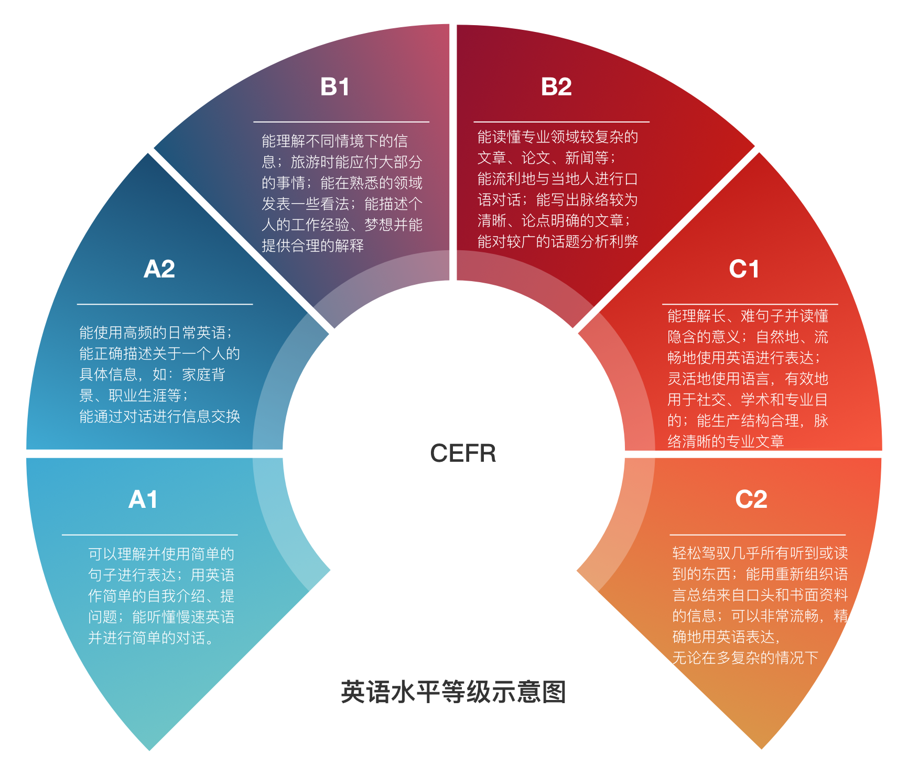

# 项目介绍

**本着毛juicy在抢救失足运动中提出的“惩前毖后，治病救人”和《转法轮》中的“真正往高层次上带人”的两大指导方针，我写下这篇入门版教程，能帮一个算一个。**

## 核心原则

“霍元甲，你嘛时候是津门第一？”

“我不知道，你说呢？”

**“就在今天！就在今天！”**

——收藏了一堆看着“很好很强大”的长篇学习经验，准备有空细读，**而这一天TM永远不会到来**。

——买了一本**远超自己能力范围**的英语教材/小说，花了一个礼拜，硬着头皮读了三页纸，生词标记得密密麻麻，然后果断放弃，放回书架上吃灰。

——……

扪心自问，你学英文是想干嘛？你还能在《纽约客》（*The New Yorker*）上发表短篇小说不成？

别傻了，绝大多数浪人的**中文水平**，也就比你平子哥强一点点而已，更别提英文了。

咱们要实事求是，脚踏实地：**别骗自己了，要学英语就从今天开始，为的是日后能在英语国家站住脚**。

我由衷地希望大家能**热爱**学习英语这件事情，如果做不到，那就尝试着去发现这件事情的乐趣亦或是收益。请允许我奉上乔布斯的一段话(原话指的是工作，表达的意义却是一致的)：

The only way to do great work is to love what you do. If you haven't found it yet, keep looking. Don't settle. As with all matters of the heart, you'll know when you find it.
>成就一番伟业的唯一途径就是热爱自己的事业。如果你还没能找到让自己热爱的事业，继续寻找，不要放弃。跟随自己的心，总有一天你会找到的。

**热爱之于学习**，同样如此。

在这份指南里，我会尽可能地综合我主观的看法与一定的科学依据，为大家提供一份详尽的英语进阶指南，**真心希望本指南能给你带来一点小小的帮助**。

## 英语水平等级

> 本图主要参考 http://www.coe.int/en/web/common-european-framework-reference-languages/table-1-cefr-3.3-common-reference-levels-global-scale

## 章节

## 英语学习的工具

除了电子词典，[Grammarly](https://www.grammarly.com/)和[LanguageTool](https://languagetool.org/)这两个拼写检查软件，你电脑上至少得装一个。

在用谷歌搜索英语相关问题时，优先阅读[WordReference](https://forum.wordreference.com/)和[English Language & Usage Stack Exchange](https://english.stackexchange.com/)这两个网站的结果。

如果你写学术论文，[知网翻译助手](https://dict.cnki.net/index)还是蛮有用的。~~普通的社畜，请自动略过。~~

好几个人推荐过[Ludwig.guru](https://ludwig.guru/)：如果你不确定自己写的句子是否通顺，可以把句子扔到这个搜索引擎里看看。

最后是我个人常用的一个网站[Capitalize My Title](https://capitalizemytitle.com/)：当你在写邮件、文章标题，不确定哪种情况需要首字母大写时，这个网站可以自动帮你解决这个难题。

## 写在最后

**坚持先润带后润,祝鼠鼠们都能早日脱支，绝不回头看索多玛变盐柱。**

    学习，难道不是人生最棒的乐趣么？
